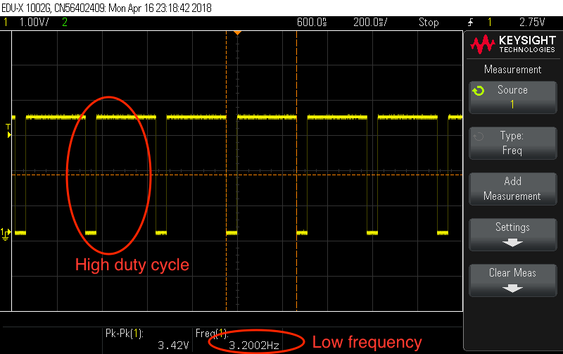

## PWM block diagram
In the following block diagram you can see the way that the LPC3250's PWM generators are wired internally. It is important to see the logic in this diagram, because then the translation to registers and code is a lot easier. The registers that we got when looking at this diagram are:

- PWMCLK_CTRL
- PWM1_RELOADV
- PWM1_DUTY
- PWM2_RELOADV
- PWM2_DUTY

There is a slight error in the diagram, because the registers that control reloadvalue and dutycycle for PWM2 are the same as those that control the corresponding stuff on PWM1. When we took a look furtheron in the datasheet, it became clear that this wasn't right. 


## Setting registers
#### PWMCLK-CTRL 0x4000 40B8

The value for this register is calculated with help from the datasheet, our findings are in the table below:

|**Bit**| 	**Function**|**Our value**|
|-------|---------------|--------------|
|0		|PWM1 block enable|	1|
|1		|PWM1 Clock select|	0 (RTC_CLOCK)|
|2		|PWM2 Block enable	|1|
|3		|PWM2 Clock select|	0 (RTC_CLOCK)|
|7:4	|	PWM1_FREQ| 1 (no clock divider)|
|11:8	|	PWM2_FREQ| 1 (no clock divider)|


#### PWM1_CTRL  0x4005 C000

The values for this register can also be found in the datasheet, findings in the table below:

|**Bit**|		**Function**|		**Our value**|
|-------|---------------|----------------|
|31|		PWM1_EN		|	1	|
|30	|	PWM1_PIN_LEVEL	|	n.v.t. | 
|15:8|		PWM1_RELOADV	|	Fout = [PWM_CLK / PWM_RELOADV] / 256|
|7:0	|	PWM1_DUTY	|	[LOW]/[HIGH] = [PWM_DUTY] / [256-PWM_DUTY]|
The PWM2_CTRL register is used in exactly the same way as the PWM1_CTRL register explained above.

##Talking to char dev's

In the previous assignments we talked to the kernel via the /sys filesystem, this time the assignment asked to implement a character device. This is a different way of communicating with the kernel, that requires some specific implementation from our side. In this chapter we will highlight some pieces of code that made the char dev work. 

###Major and minor numbers
The major number of our driver is automatically assigned when we initialize our module. 

```
major_number = register_chrdev(0, DEVICE_NAME, &fops);
```


To respond to the correct device node from our driver, we have to find out the minor number. The minor number is somewhat hidden in the *inode* struct that is given as an argument with the *device_open* function. 

```
minor_number = MINOR(inode->i_rdev);
```

We then save this number in the private_data field of the file struct, which we also get as an argument with the *device_open* function.

```
file->private_data = (void *) minor_number;
```

In the functions that are called when a user writes to the file, or wants to read from the file we switch on that minor number. This way we can distinguish between different actions we want to happen when a specific file is called. 

###Actions

|**Minor number**|**action when user reads**|**action when user writes**|**accepted values**|
|-----------|------------|-----------|-------|
|0| return state of pwm1| set state of pwm1| 0 or 1|
|1| return value of PWM1 reload value| set value of PWM1 reload value| 0-255|
|2| return value of PWM1 duty cycle| set value of PWM1 duty cycle|0-255|
|3| return state of pwm2| set state of pwm2| 0 or 1|
|4| return value of PWM2 reload value| set value of PWM2 reload value| 0-255|
|5| return value of PWM2 duty cycle| set value of PWM2 duty cycle| 0-255|

To create the correct /dev nodes, we created a bash script to take the minor number (which you get in kernel logs), and create the corresponding 6 nodes with the correct minor numbers. This script basically calls *mknod* 6 times with different parameters.

We wanted to let the user fill in the frequency instead of a 8-bit value from 0 to 255, but we couldn't make the conversion work the way we wanted (it couldn't compile . The code for the conversion from frequency to the register value would have been:

```
float secs = 1 / (float)input;
float output = (secs * CLK_FREQ) / 256;
```

The errors that we encountered most likely have to do with the fact that the kernel not really supports using floating points in the kernel itself. When it is used from a userspace program the kernel can handle it, but when we try to do it from inside the kernel there are errors. The solution to this problem is to calculate the correct values in the userspace program that calls our module.
[source](https://tapaswenipathak.wordpress.com/2014/11/27/faults-in-linux-saying-yes-to-floating-point-values/) & [another source](https://lists.gt.net/linux/kernel/820906)

###Return value and copy_to_user

The following piece of code is in the *device_read* function, to copy the buffer we filled earlier to the /dev file (so that the user can read it) and to let the kernel know how many bytes that still have to be read (this is made sure to be 0, so we don't call this function twice).

```
if (*offset != 0) {
        return 0;
    }
    
bytes_remaining = copy_to_user(buffer, msg, msg_length);
*offset += msg_length - bytes_remaining;
return msg_length - bytes_remaining;
```


##Testing

To test our module, we used an oscilloscope connected to the correct pins on the LPC board. The pins that have to be used can be found in the schematic that was delivered with the board. At first we could not find the pins for the output of PWM1 and PWM2, but we found out that these are used for driving the LCD. This is why we have to disable the LCD for the PWM to work:

```
*(unsigned int *) (io_p2v(LCDCONFIG_REG)) = LCDCONFIG;
```

The pins that break out PWM1 and PWM2 are:


Our test setup looked like this:


###Oscilloscope results


- Reloadvalue: 1 (which should be about 125Hz)
- Dutycycle: 1


- Reloadvalue: 10 (which should be about 12.5Hz)
- Dutycycle: 1



- Reloadvalue: 40 (which should be about 3.125Hz)
- Dutycycle: 200

From this testing you can see that the implemented functions work, and that the calculation that we wanted to implement was also right. The frequencies were not spot-on, but we think this is due to a loss of precision or a measurement inaccuracy. 

