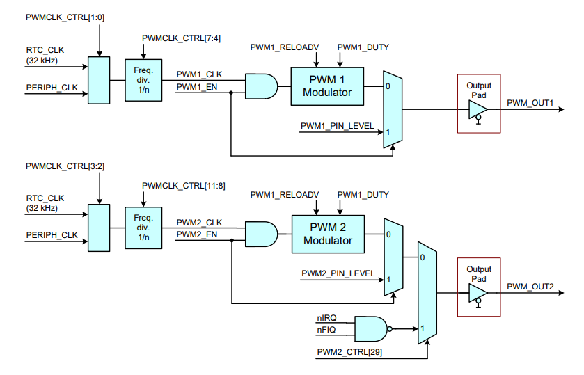

## PWM block diagram





## Setting PWM_OUT1
#### PWMCLK-CTRL 0x4000 40B8

|**Bit**| 	**Function**|**Our value**|
|-------|---------------|--------------|
|0		|PWM1 block enable|	x|
|1		|PWM1 Clock select|	1 (PERIPH_CLOCK)|
|2		|PWM Block enable	|x|
|3		|PWM2 Clock select|	1 (PERPIH_CLOCK)|
|7:4	|	PWM1_FREQ|
|11:8	|	PWM2_FREQ|


#### PWM1_CTRL  0x4005 C000

|**Bit**|		**Function**|		**Our value**|
|-------|---------------|----------------|
|31|		PWM1_EN		|	1	|
|30	|	PWM1_PIN_LEVEL	|	n.v.t. | 
|15:8|		PWM1_RELOADV	|	Fout = [PWM_CLK / PWM_RELOADV] / 256|
|7:0	|	PWM1_DUTY	|	[LOW]/[HIGH] = [PWM_DUTY] / [256-PWM_DUTY]|

##Talking to char dev's

In the previous assignments we talked to the kernel via the /sys filesystem, this time the assignment asked to implement a character device. This is a different way of communicating with the kernel, that requires some specific implementation from our side. In this chapter we will highlight some pieces of code that made the char dev work. 

###Major and minor numbers
The major number of our driver is automatically assigned when we initialize our module. 

```
major_number = register_chrdev(0, DEVICE_NAME, &fops);
```


To respond to the correct device node from our driver, we have to find out the minor number. The minor number is somewhat hidden in the *inode* struct that is given as a argument with the device_open function. 

```
minor_number = MINOR(inode->i_rdev);
```

##Testing

To test our module, we used an oscilloscope connected to the correct pins on the LPC board. The pins that have to be used can be found in the schematic that was delivered with the board. 

