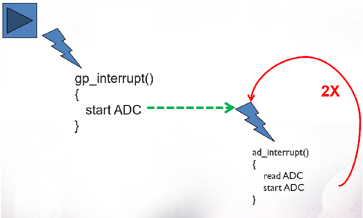

# Firing interrupts and reading the ADC on the LPC3250
Stefan Grimminck & Skip Geldens
T62

## Part 1: Discovery 
We set out to make a kernel module for a customer that want to read the ADC values via a character device. First we created a program to write the ADC values to the kernel log when the button connected to EINT0 was pressed. After that we impelented the devfs_read() so that the user could make use of the converted ADC values via device nodes.

### Trigger ADC on button interrupt
According to the sheet below the gp_interrupt function should be called when EINT0 is pressed. This function then starts the ADC, which calculates the conversion values. This is done for the tree ADC registers (so three times).



The intiale state of the button interupt is set to level-edged, which is in our case not useful. This is why we first set the trigger to level-edged with the following c code.
```c
	data = READ_REG(SIC2_ATR);
	data |= EINT0_LOC;
	WRITE_REG (data, SIC2_ATR);
 ``` 
 Where SIC2_ATTR is the Sub2 Activation Type Register and EINT0_LOC is the 23th bit in the register (GPI_1)


