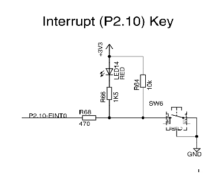

# Firing interrupts and reading the ADC on the LPC3250
Stefan Grimminck & Skip Geldens
T62

## Part 1: Assignment 1 
We set out to make a kernel module for a customer that want to read the ADC values via a character device. First we created a program to write the ADC values to the kernel log when the button connected to EINT0 was pressed. After that we impelented the devfs_read() so that the user could make use of the converted ADC values via device nodes.

### triggering an interrupt on button EINT0
According to the sheet below the gp_interrupt function should be called when EINT0 is pressed. This function then starts the ADC, which calculates the conversion values. This is done for the tree ADC registers (so three times).


First we need to find the port the interupt key is connected to. When searching trough the system scematics we came upon this picture:



When tracing P2.10-EINT0 back to the corresponding LPC port we found out it was connected to GPI_01 and pin 7 on connector 3 (this was later used for connecting the probes for testing). We had found the LCP port by looking up "GPIO1" in Chapter 4 of the LPC3250 Development's kit - User's Guide "Signal Mapping to QVGA Base Board".

The intiale state of the button interupt is set to level-edged, which is in our case not useful. This is why we first set the trigger to level-edged with the following c code.
```c
	data = READ_REG(SIC2_ATR);
	data |= EINT0_LOC;
	WRITE_REG (data, SIC2_ATR);
 ``` 
 Where SIC2_ATTR is the Sub2 Activation Type Register and EINT0_LOC is the 23th bit in the register (GPI_1). See table below:
 
 
 
 ### Convertions with the ADC
 Now that the button works we can start working on using the ADC itself.

The ADC interrupt are requested with the following code:
```c
    if (request_irq (IRQ_LPC32XX_TS_IRQ, adc_interrupt, IRQF_DISABLED, "IRQ_ADC_INT_INTERRUPT", NULL) != 0)
    {
        printk(KERN_ALERT "ADC IRQ request failed\n");
    }
  ```
This code was already written for us, but we had to find the interrupt line to allocate ourselves, wich became 'IRQ_LPC32XX_TS_IRQ' for the adc interrupt and 'IRQ_LPC32XX_GPI_01' for the button interrupt.

The ADC interrupt line to allocated is located in "Interrupt Enable Register for Sub Interrupt Controller 1"  with bit 7 (Touch screen irq interrupt)

When the EINT0 button is pressed, the GP_Interupt will fire and call function start_adc() this function selects the right A/D channel to convert with the following code:
```c
WRITE_REG((data & ~0x0030) | ((channel << 4) & 0x0030), ADC_SELECT);
```
and start the ADC convertion with:
```c
    /* Bit 2 in register ADC_CTRL set => the ADC is powered up and reset */
   	data = READ_REG(ADC_CTRL);
	data |= AD_PDN_CTRL;
	WRITE_REG (data, ADC_CTRL);
```
This code has been created according to the A/D Control Register:


After the conversion has finished the the `adc_interrupt (int irq, void * dev_id)` is called and values logged into the kernel log.

Both the interrupts can be found in /proc/interrupts `IRQ_ADC_INT_INTERRUPT` for our ADC and `IRQ_GPI_01_INTERRUPT` for our button (which are a bit unfortunately named):


### Making the kernel sleep
We also make use of the `wait_event_interruptible()` and `wake_up_interruptible()` functions for letting the kernel sleep. We do this because it takes some time before the ADC values are calculated. After the calculations have been done and the adc interrupt is triggered the process get awakend again.

### Potentiometer & Accelerometer values

The values the ADC outputs correnspond with the onboard accelerometer & potmeter. This can be found in QVGA_Base_Board_v1.2.pdf:


As described above channels 0 is connected to x-axis, 1 is connected to y-axis and 2 is connected to the z-axis of the accelerometer.
The potmeter is also connected to channel 2 as stated below:


The devices that is connected to this channel is decided on the basis of which jumper is connected:


Our user also must be able to receive the ADC values not via kernel log, but device nodes. Each node gets its own adc convertion, so: ADC(0) get minor number 0,  ADC(1) get minor number 1, and ofcourse  ADC(2) get minor number 2.

Our minor number is saved in a stuct called "DeviceInfo" and is retrieved and coupled to a channel with the following code:
```c
	DriverInfo* info = (DriverInfo*)file->private_data;
	int channel = info->minor;
```

Struct DriverInfo is implented as follows:
```
typedef struct DriverInformation{
	char msg[BUF_SIZE];
	int minor;
}DriverInfo;
```
After the paring the minor number with the channel the ADC is started with `adc_start (channel);`


## Testing ADC data

Testing acceloreter data by moving the board horizontal:


Testing acceloreter data by moving the board vertical:


Testing the board by changing the value of the Red Potentiometer


Testing retrieving ADC data via device nodes:


## Testing ADC speed

The speeds have been tested by setting or clearing an output pin on the Connectors. This is done by:

Pin high: 
```c
	*(unsigned int*)(LPC32XX_CLKPWR_LCDCLK_CTRL) = 0x00;
	*(unsigned int*)(io_p2v(0x40028044)) = (1 << 1); 
```

Pin low:
```c
	*(unsigned int*)(LPC32XX_CLKPWR_LCDCLK_CTRL) = 0x00;
	*(unsigned int*)(io_p2v(0x40028048)) = (1 << 1); 
```
Time for gp interupt to fire after EINT0 pressed


Time for adc interupt to fire after EINT0 pressed


Time it takes to do the ADC conversion.


